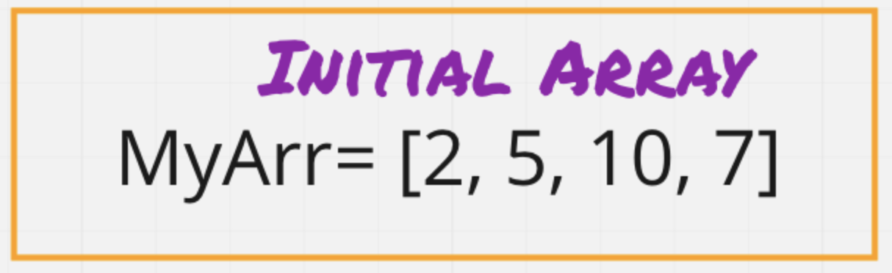
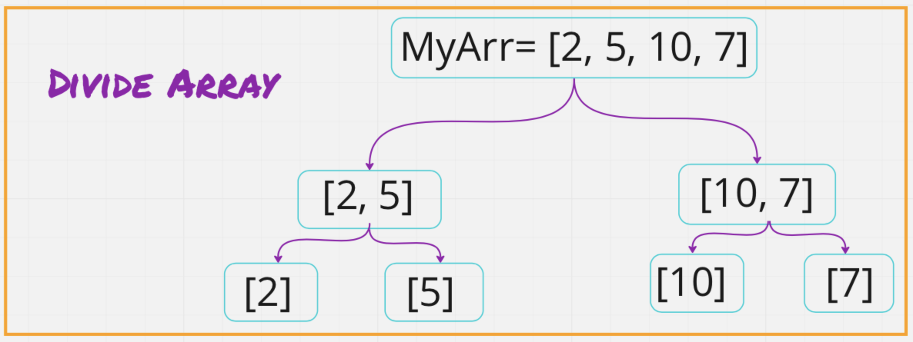
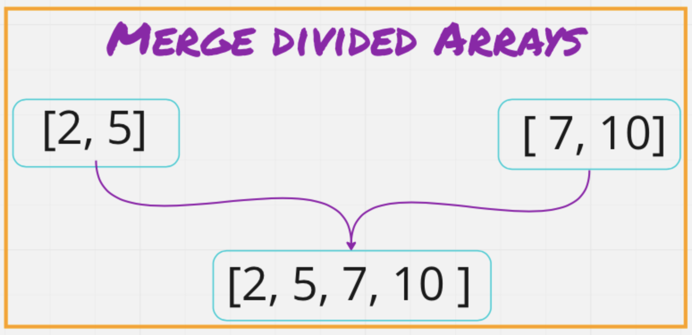

# Merge Sort

- Merge sort basically take a "command and conqour approach.

- It devides and initial array in half into smaller sub arrays.

- It does this until you are left with one element in an array or a single element array.

- Then the single arrays are merged and sorted.

- It will repeat this until both halves are completed.

### Pseudo Code

```java
ALGORITHM Mergesort(arr)
DECLARE n <-- arr.length

    if n > 1
      DECLARE mid <-- n/2
      DECLARE left <-- arr[0...mid]
      DECLARE right <-- arr[mid...n]
      // sort the left side
      Mergesort(left)
      // sort the right side
      Mergesort(right)
      // merge the sorted left and right sides together
      Merge(left, right, arr)

ALGORITHM Merge(left, right, arr)
DECLARE i <-- 0
DECLARE j <-- 0
DECLARE k <-- 0

    while i < left.length && j < right.length
        if left[i] <= right[j]
            arr[k] <-- left[i]
            i <-- i + 1
        else
            arr[k] <-- right[j]
            j <-- j + 1

        k <-- k + 1

    if i = left.length
       set remaining entries in arr to remaining values in right
    else
       set remaining entries in arr to remaining values in left


```

## Step One

- begin with an unsorted array



## Step Two

- Devide the array into halves until we get single element arrays.



## Step Three

- Merge single set arrays into new array and sort.



## Code

- ### _Function Merge()_

```javascript
function merge(left, right) {
  let arr = [];
  while (left.length && right.length) {
    if (left[0] < right[0]) {
      arr.push(left.shift());
    } else {
      arr.push(right.shift());
    }
  }
  return [...arr, ...left, ...right];
}
```

- ### _Function MergeSort()_

```javascript
function mergeSort(array) {
  if (array.length === 0) {
    throw new Error("Input array is empty!");
  }
  const half = array.length / 2;
  if (array.length < 2) {
    return array;
  }
  const left = array.splice(0, half);
  return merge(mergeSort(left), mergeSort(array));
}
```

## Testing

```javascript
describe("merge sort ", () => {
  it("merge and sorts array =>", () => {
    const array = [8, 4, 23, 42, 16, 15];
    let str = mergeSort(array);
    expect(str).toStrictEqual([4, 8, 15, 16, 23, 42]);
    console.log("merge and sorts Array =>", str);
  });

  it("sorts array revered-sorted", () => {
    const array = [20, 18, 12, 8, 5, -2];

    let str = mergeSort(array);
    expect(str).toStrictEqual([-2, 5, 8, 12, 18, 20]);
    console.log("revered-sorted Array =>", str);
  });

  it("sorts an array with few uniques", () => {
    const arr = [5, 12, 7, 5, 5, 7];

    let str = mergeSort(arr);
    expect(str).toEqual([5, 5, 5, 7, 7, 12]);
    console.log("Few uniques =>", str);
  });

  it("sorts nearly-sorted array", () => {
    const arr = [2, 3, 5, 7, 13, 11];

    let str = mergeSort(arr);
    expect(str).toEqual([2, 3, 5, 7, 11, 13]);
    console.log("nearly-sorted =>", str);
  });
});
```
