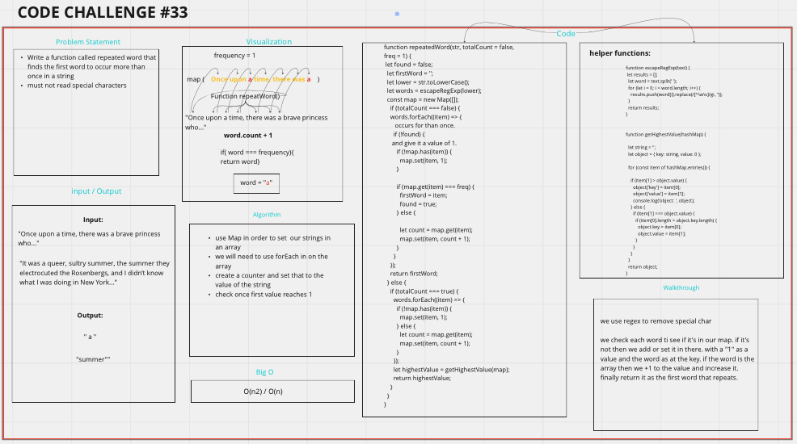

> # Code Challenge 31

# repeat-Word

## Challenge Summary

- Write a function called repeated word that finds the first word to occur more than once in a string
  - Arguments: string
  - Return: string

## Whiteboard Process



## Approach & Efficiency

we use regex to remove special char

we check each word ti see if it's in our map. if it's not then we add or set it in there. with a "1" as a value and the word as at the key. if the word is the array then we +1 to the value and increase it. finally return it as the first word that repeats.

## Solution

```javascript
function repeatedWord(str, totalCount = false, freq = 1) {
  let found = false;
  let firstWord = "";
  let lower = str.toLowerCase();
  let words = escapeRegExp(lower);
  const map = new Map([]);

  if (totalCount === false) {
    words.forEach((item) => {
      if (!found) {
        if (!map.has(item)) {
          map.set(item, 1);
        }

        if (map.get(item) === freq) {
          firstWord = item;
          found = true;
        } else {
          let count = map.get(item);
          map.set(item, count + 1);
        }
      }
    });
    return firstWord;
  } else {
    if (totalCount === true) {
      words.forEach((item) => {
        if (!map.has(item)) {
          map.set(item, 1);
        } else {
          let count = map.get(item);
          map.set(item, count + 1);
        }
      });
      let highestValue = getHighestValue(map);
      return highestValue;
    }
  }
}

function escapeRegExp(text) {
  let results = [];
  let word = text.split(" ");
  for (let i = 0; i < word.length; i++) {
    results.push(word[i].replace(/[^\w\s]/gi, ""));
  }
  return results;
}

function getHighestValue(hashMap) {
  let string = "";
  let object = { key: string, value: 0 };

  for (const item of hashMap.entries()) {
    if (item[1] > object.value) {
      object["key"] = item[0];
      object["value"] = item[1];
      console.log("object: ", object);
    } else {
      if (item[1] === object.value) {
        if (item[0].length > object.key.length) {
          object.key = item[0];
          object.value = item[1];
        }
      }
    }
  }
  return object;
}
```
