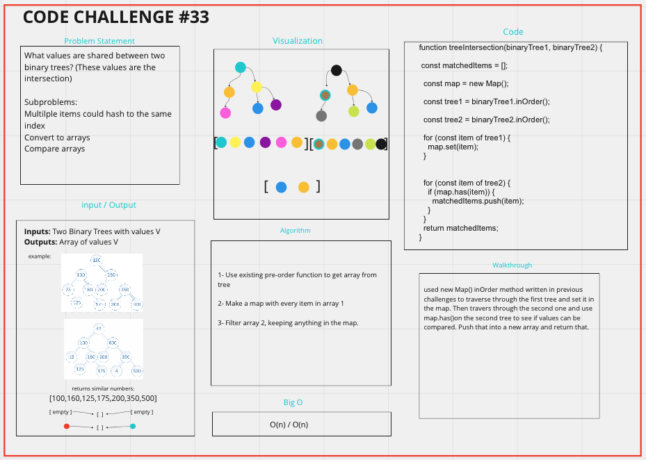

> # Code Challenge 32

# Tree-Intersection

## Challenge Summary

- Write a function called tree_intersection that takes two binary trees as parameters.
- Using your Hashmap implementation as a part of your algorithm, return a set of values found in both trees.

## Whiteboard Process



## Approach & Efficiency

used new Map() inOrder method written in previous challenges to traverse through the first tree and set it in the map. Then travers through the second one and use map.has()on the second tree to see if values can be compared. Push that into a new array and return that.

## Solution

```javascript
function treeIntersection(binaryTree1, binaryTree2) {
  const matchedItems = [];
  const map = new Map();
  const tree1 = binaryTree1.inOrder();
  const tree2 = binaryTree2.inOrder();
  for (const item of tree1) {
    map.set(item);
  }

  for (const item of tree2) {
    if (map.has(item)) {
      matchedItems.push(item);
    }
  }
  return matchedItems;
}
```

### Collaborators

- Tony Regalado (the g.o.a.t.)
